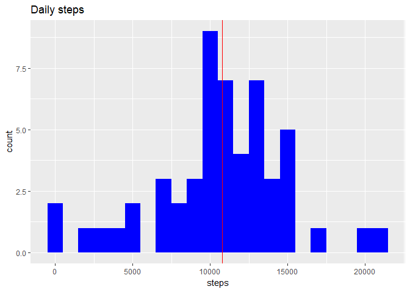
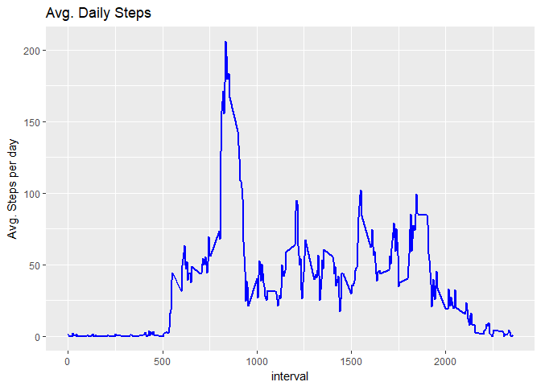
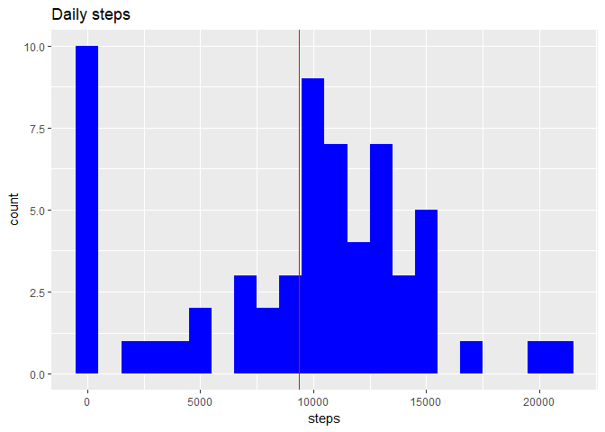
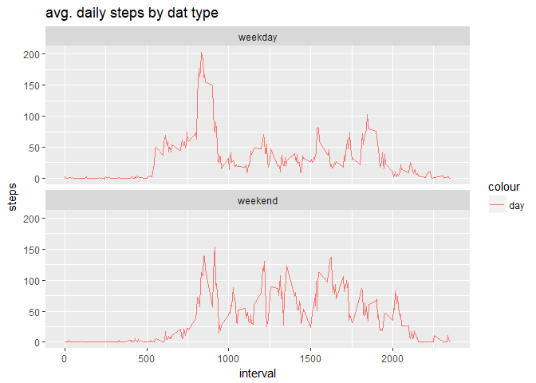

Introduction
------------

It is now possible to collect a large amount of data about personal movement using activity monitoring devices such as a Fitbit, Nike Fuelband, or Jawbone Up. These type of devices are part of the "quantified self" movement - a group of enthusiasts who take measurements about themselves regularly to improve their health, to find patterns in their behavior, or because they are tech geeks. But these data remain under-utilized both because the raw data are hard to obtain and there is a lack of statistical methods and software for processing and interpreting the data.

This assignment makes use of data from a personal activity monitoring device. This device collects data at 5 minute intervals through out the day. The data consists of two months of data from an anonymous individual collected during the months of October and November, 2012 and include the number of steps taken in 5 minute intervals each day.

The data for this assignment can be downloaded from the course web site:

-   Dataset: [Activity monitoring data](https://d396qusza40orc.cloudfront.net/repdata%2Fdata%2Factivity.zip)

The variables included in this dataset are:

steps: Number of steps taking in a 5-minute interval (missing values are coded as ????????) </br> date: The date on which the measurement was taken in YYYY-MM-DD format </br> interval: Identifier for the 5-minute interval in which measurement was taken </br> The dataset is stored in a comma-separated-value (CSV) file and there are a total of 17,568 observations in this dataset.

Loading and preprocessing the data
----------------------------------

Unzip data to obtain a csv file.

``` r
library("data.table")
library(ggplot2)
```

    ## Warning: package 'ggplot2' was built under R version 3.4.1

``` r
fileUrl <- "https://d396qusza40orc.cloudfront.net/repdata%2Fdata%2Factivity.zip"
download.file(fileUrl, destfile = paste0(getwd(), '/repdata%2Fdata%2Factivity.zip'))
unzip("repdata%2Fdata%2Factivity.zip",exdir = "data")
```

Reading csv Data into Data.Table.
---------------------------------

``` r
activityDT <- data.table::fread(input = "data/activity.csv")
```

What is mean total number of steps taken per day?
-------------------------------------------------

1.  Calculate the total number of steps taken per day

``` r
totalSteps <- aggregate(steps ~ date, activityDT, sum)
head(totalSteps, 10)
```

    ##          date steps
    ## 1  2012-10-02   126
    ## 2  2012-10-03 11352
    ## 3  2012-10-04 12116
    ## 4  2012-10-05 13294
    ## 5  2012-10-06 15420
    ## 6  2012-10-07 11015
    ## 7  2012-10-09 12811
    ## 8  2012-10-10  9900
    ## 9  2012-10-11 10304
    ## 10 2012-10-12 17382

1.  If you do not understand the difference between a histogram and a barplot, research the difference between them. Make a histogram of the total number of steps taken each day.

``` r
ggplot2::ggplot(totalSteps, aes(x=steps)) + 
    geom_histogram(fill="blue", binwidth = 1000) + 
    geom_vline(xintercept =  mean(totalSteps$steps), color="red") +
    labs(title="Daily steps", x="steps","frequency")
```



1.  Calculate and report the mean and median of the total number of steps taken per day

``` r
mean(totalSteps$steps, na.rm = TRUE)
```

    ## [1] 10766.19

``` r
median(totalSteps$steps, na.rm = TRUE)
```

    ## [1] 10765

What is the average daily activity pattern?
-------------------------------------------

calculate average of steps taken every day

``` r
intervalDt <- aggregate(steps ~ interval, activityDT, mean)
head(intervalDt)
```

    ##   interval     steps
    ## 1        0 1.7169811
    ## 2        5 0.3396226
    ## 3       10 0.1320755
    ## 4       15 0.1509434
    ## 5       20 0.0754717
    ## 6       25 2.0943396

1.  Make a time series plot (i.e. type = "l") of the 5-minute interval (x-axis) and the average number of steps taken, averaged across all days (y-axis)

``` r
ggplot2::ggplot(data=intervalDt, aes(x = interval, y = steps)) +
            geom_line(color="blue", size=1) +
            labs(title="Avg. Daily Steps", x="interval",y="Avg. Steps per day")
```



1.  Which 5-minute interval, on average across all the days in the dataset, contains the maximum number of steps?

``` r
intervalDt$interval[which.max(intervalDt$steps)]
```

    ## [1] 835

Imputing missing values
-----------------------

Note that there are a number of days/intervals where there are missing values (coded as NA). The presence of missing days may introduce bias into some calculations or summaries of the data.

1- Calculate and report the total number of missing values in the dataset (i.e. the total number of rows with NAs)

``` r
sum(is.na(activityDT$steps))
```

    ## [1] 2304

``` r
mean(is.na(activityDT$steps))
```

    ## [1] 0.1311475

Total number of missing values in the dataset amounts is 2304 (13.1 % of total observations).

2- Devise a strategy for filling in all of the missing values in the dataset. The strategy does not need to be sophisticated. For example, you could use the mean/median for that day, or the mean for that 5-minute interval, etc.

``` r
activityDTWithoutNA <- activityDT
# Filling in missing values with median of dataset. 
activityDTWithoutNA[is.na(steps), "steps"] <- activityDTWithoutNA[, c(lapply(.SD, median, na.rm=TRUE)),  .SDcols = c("steps")]
```

3- Create a new dataset that is equal to the original dataset but with the missing data filled in.

``` r
data.table::fwrite(x = activityDT, file = "tidyData.csv", quote = FALSE)
```

4- Make a histogram of the total number of steps taken each day and Calculate and report the mean and median total number of steps taken per day. Do these values differ from the estimates from the first part of the assignment? What is the impact of imputing missing data on the estimates of the total daily number of steps?

``` r
totalSteps <- aggregate(steps ~ date, activityDTWithoutNA, sum)
head(totalSteps)
```

    ##         date steps
    ## 1 2012-10-01     0
    ## 2 2012-10-02   126
    ## 3 2012-10-03 11352
    ## 4 2012-10-04 12116
    ## 5 2012-10-05 13294
    ## 6 2012-10-06 15420

``` r
ggplot2::ggplot(totalSteps, aes(x=steps)) + 
    geom_histogram(fill="blue", binwidth = 1000) + 
    geom_vline(xintercept =  mean(totalSteps$steps), color="red") +
    labs(title="Daily steps", x="steps","frequency")
```



calculate mean and median after fill in NA with meadian

``` r
mean(totalSteps$steps)
```

    ## [1] 9354.23

``` r
median(totalSteps$steps)
```

    ## [1] 10395

Are there differences in activity patterns between weekdays and weekends?
-------------------------------------------------------------------------

1- Create a new factor variable in the dataset with two levels - "weekday" and "weekend" indicating whether a given date is a weekday or weekend day.

``` r
library(lubridate)
```

    ## Warning: package 'lubridate' was built under R version 3.4.1

    ## 
    ## Attaching package: 'lubridate'

    ## The following objects are masked from 'package:data.table':
    ## 
    ##     hour, isoweek, mday, minute, month, quarter, second, wday,
    ##     week, yday, year

    ## The following object is masked from 'package:base':
    ## 
    ##     date

``` r
library(dplyr)
```

    ## Warning: package 'dplyr' was built under R version 3.4.1

    ## 
    ## Attaching package: 'dplyr'

    ## The following objects are masked from 'package:lubridate':
    ## 
    ##     intersect, setdiff, union

    ## The following objects are masked from 'package:data.table':
    ## 
    ##     between, first, last

    ## The following objects are masked from 'package:stats':
    ## 
    ##     filter, lag

    ## The following objects are masked from 'package:base':
    ## 
    ##     intersect, setdiff, setequal, union

``` r
is_WeekDay <- function(date){
    if(wday(date) %in% c(1,7))  "weekend"
    else "weekday"
}

activityDTWithoutNA <- mutate(activityDTWithoutNA, date=ymd(date)) %>%
                        mutate(day=sapply(date,is_WeekDay))
```

    ## Warning: package 'bindrcpp' was built under R version 3.4.1

``` r
head(activityDTWithoutNA,10)
```

    ##    steps       date interval     day
    ## 1      0 2012-10-01        0 weekday
    ## 2      0 2012-10-01        5 weekday
    ## 3      0 2012-10-01       10 weekday
    ## 4      0 2012-10-01       15 weekday
    ## 5      0 2012-10-01       20 weekday
    ## 6      0 2012-10-01       25 weekday
    ## 7      0 2012-10-01       30 weekday
    ## 8      0 2012-10-01       35 weekday
    ## 9      0 2012-10-01       40 weekday
    ## 10     0 2012-10-01       45 weekday

``` r
table(activityDTWithoutNA$day)
```

    ## 
    ## weekday weekend 
    ##   12960    4608

2- Make a panel plot containing a time series plot (i.e. type = "l") of the 5-minute interval (x-axis) and the average number of steps taken, averaged across all weekday days or weekend days (y-axis). See the README file in the GitHub repository to see an example of what this plot should look like using simulated data.

``` r
intervalDt <- aggregate(steps ~ interval + day, activityDTWithoutNA, mean)
ggplot2::ggplot(data = intervalDt, 
                aes(x=interval, y=steps, color="day")) +
            geom_line() +
            labs(title="avg. daily steps by dat type", x="interval",y="steps")+
            facet_wrap(~`day`, ncol=1,nrow=2)
```


